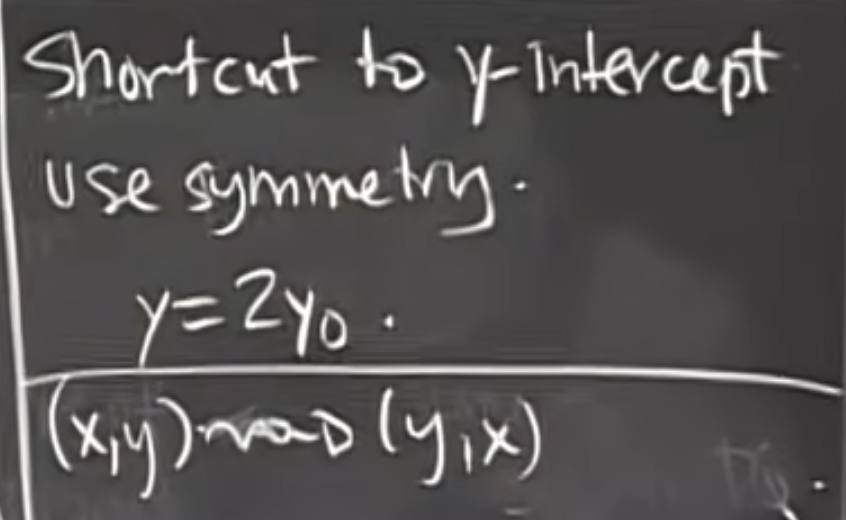

# 18.01 | UNIT 1 | Differentiation

A. **What is a Derivative?**
* Geometric Interpretation
* Physical Interpretation
* Importance of Derivative to all measurements
* (Science, Engineering, Economic, Political Science, etc)

B. **How to Differentiate Any thing, (Any function you know)**

$$\displaystyle\Large\frac{d}{dx}e^{x \cdot arctan(x)}$$

GEOMETRIC INTERPRETATION

Find the Tangent Line to $y = f(x)$ at Point $P = (x_0,y_0):$

$$\Large y-y_0 = m(x-x_0)$$
 
$$\mathbb{point} \rightarrow y_0 = f(x_0)$$

$$\mathbb{slope} \rightarrow m = f'(x_0)$$

**Definition** : $f'(x_0)$, the derivative of $f$ at $x_0$, is the slope of the tangent line to $y=f(x)$ at P.

# TANGENT LINE = LIMITS OF SECANT LINES PQ AS $Q \rightarrow P.$ (P fixed)

$$\displaystyle \Large m = \lim_{\Delta x \rightarrow 0} \frac{\Delta F}{\Delta x}$$

# Difference Quotient

# Example 1 : $$f(x) = \frac{1}{x}$$

# FIND AREAS OF TRIANGLES ENCLOSED BY AXES AND TANGENT TO   $y = \frac{1}{x}$

# Find X - Intercept

# Shortcut to Y-Intercept to use Symmetry

 

# More Notations

# Example 2 : $f(x)=x^n,$ n = 1,2,3,...

